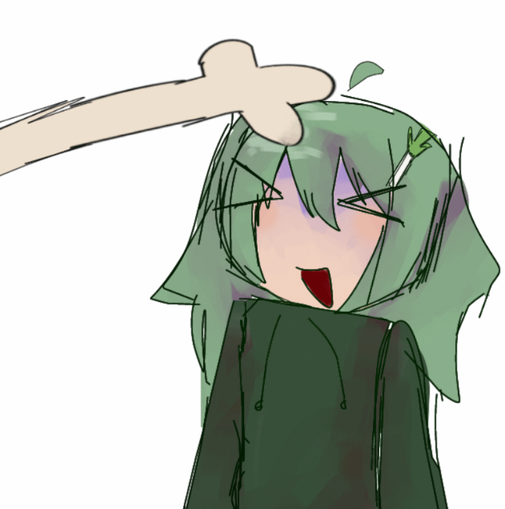

# 👋 Opa, eu sou o EduDev!

Sou programador e mexo principalmente com Python e Discord.

Eu gosto de criar umas coisas totalmente aleatórias dentro do Discord e ver no que dá KKKKKKK

Às vezes começa como uma ideia besta e, quando eu percebo, virou um sistema inteiro.

🍃 Negi

A Negi é o meu principal projeto atualmente.

É um bot de Discord que eu venho desenvolvendo e que é focado principalmente em:

- 🔧 Comandos utilitários
- 😂 Comandos de meme
- 🎮 Minigames
- 🧪 E outras ideias aleatórias que acabam entrando no bot

O código da Negi é privado, mas dá pra conhecer o projeto por aqui:

🌐 [Site da Negi](https://negi-website.vercel.app)
💬 [Servidor oficial da Negi](https://discord.gg/PpVtMgDswB)

 O que eu uso

 Python
 discord.py
 SQLite
 Git / GitHub

🧠 Sobre meus projetos

Eu gosto mais de fazer as coisas funcionarem do que ficar documentando tudo KKKKKKK.

Por isso, eu não tenho projetos postados aqui no github mas pretendo um dia organizar e postar algumas coisinhas por aqui :3

Mas é justamente daí que saem algumas das ideias mais legais.

---

«💚 Criar alguma coisa aleatória, ver se funciona e depois descobrir onde aquilo pode chegar.»

  

